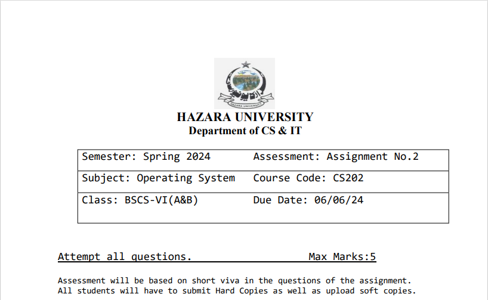

## Question 1:
`Discuss and explain banker’s algorithm with a suitable example. (2) `
## Answer:

## Banker's Algorithm

The Banker's Algorithm is a resource allocation and deadlock avoidance algorithm used in operating systems. It is used to ensure that the system will never enter an unsafe state by denying requests that would put the system in such a state.

The algorithm works as follows:

1. Each process declares the maximum number of instances of each resource type that it may need.
2. When a process requests a resource, the system checks if granting the request will leave the system in a safe state. If so, the request is granted, otherwise, the request is delayed or denied.
3. When a process finishes with a resource, it returns the resource to the system.

Here's an example to illustrate how the Banker's Algorithm works:

Suppose we have 5 processes (P0 - P4) and 3 resource types (A, B, C). The maximum number of resources each process can claim, the current allocation, and the available resources are as follows:

| Process | Max | Allocation | Need |
|---------|-----|------------|------|
| P0      | (7, 5, 3) | (0, 1, 0) | (7, 4, 3) |
| P1      | (3, 2, 2) | (2, 0, 0) | (1, 2, 2) |
| P2      | (9, 0, 2) | (3, 0, 2) | (6, 0, 0) |
| P3      | (2, 2, 2) | (2, 1, 1) | (0, 1, 1) |
| P4      | (4, 3, 3) | (0, 0, 2) | (4, 3, 1) |

Available: (3, 3, 2)

The algorithm would check if it is possible to allocate resources to each process in a way that the system remains in a safe state. If so, the request is granted, otherwise, it is denied.

## Question 2:
` Discuss virtual memory. Why we need it? Can you increase the virtual memory of 
 your computer system? If yes then write the steps. (3)`
## Answer:
## Virtual Memory

Virtual memory is a memory management technique in which the operating system provides an abstraction of the computer's physical memory. It allows programs to use more memory than is physically available by using secondary storage (e.g., hard disk) to temporarily hold parts of a program that are not currently in use.

The main reasons we need virtual memory are:

1. **Increased Efficiency**: Virtual memory allows programs to use more memory than is physically available, which can improve overall system efficiency and performance.
2. **Isolation and Protection**: Each process is given its own virtual address space, which isolates it from other processes and protects the system from malicious or erroneous programs.
3. **Simplified Programming**: Virtual memory abstracts away the physical details of the memory system, making it easier for programmers to write and debug their code.

To increase the virtual memory of our computer system, we can follow these steps:

1. Open the Control Panel.
2. Go to "System" and then click on "Advanced system settings".
3. In the "System Properties" window, click on the "Advanced" tab and then click on the "Settings" button under the "Performance" section.
4. In the "Performance Options" window, click on the "Advanced" tab and then click on the "Virtual memory" button.
5. In the "Virtual Memory" window, we can change the initial size and maximum size of the paging file. Increasing the maximum size will effectively increase the virtual memory of your system.
6. Click "OK" to save the changes and close the windows.

Increasing the virtual memory may not always improve performance, as it depends on the specific workload and the available physical memory of your system.